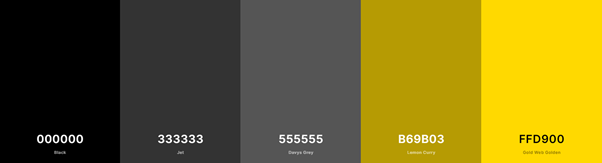
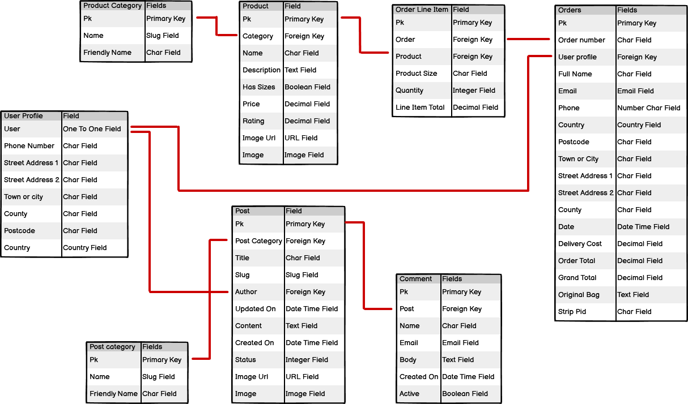

# Hive Fitness - An online fitness community!

Welcome to Hive Fitness, a website for users all over the world buy top quality 
fitness equipment in order to reach their training goals. It also includes a blog
wgich is regularly updated with arlicles about a variety of fitness topics.  This 
allows our customers to comment and discuss these topics with a community of like 
minded people. Made for my Code Institute Milestone Project 4.

Follow the link to [Hive Fitness](#deployed app url)

### Contents

* [Introduction](#intro) 

* [UX](#ux)
  * [Strategy Plane](#strategy)
  * [Scope Plane](#scope)
  * [Structure Plane](#structure)
  * [Skeleton Plane](#skeleton)
  * [Surface Plane](#surface)

* [Technologies](#tech) 
  * [Languages](#languages)
  * [Database](#database)
  * [Libraries](#libraries)
  * [Tools](#tools)
  * [Hosting](#hosting)

* [Features](#feat)
  * [Current logins](#current)
  * [Active features](#active)
  * [Future features](#future)

* [Testing](#test)

* [Deployment](#deploy)
  * [Deploy project](#deploy)
  * [Run project](#run)
  * [Clone project](#clone)

* [Credits](#credit)
  * [Code credits](#code)
  * [Media credits](#media)
  * [Acknowledgements](#acknowledgements)
___

### Introduction

This website is designed to be a full stack development project. By doing so users have 
access to a fully functioning e-store and can order a wide variety of fitness equipment. 
Each product has it's own page with information, cost and rating. Also visitors have access 
to a blog which covers a wide range of topics from latest product reviews to training tips 
and ideas. By signing up as a user, visitors can leave comments on specific stricles and 
posts, enabling them to become part of the discussion. 
___

### UX

### Strategy Plane
#### Potential Users

Target Audience
* People who are fitness enthusiasts
* People who are interested in trying a new workout plan
* People who want to replace a peice of equipment
* People who wish to join an online fitness community

Visitor / User Goals
* Purchase products in a smooth and secure way
* Get informed with the products before buying by product ratings / product information
* Gain knowledgefrom blog articles and leave comments on those blog articles

Business Goals (Site Owner's Goals)
* Provide customers with a secure and safe online store
* Establish the shop's brand image
* Expand the business with a community blog
* Make profit from selling products

### Scope Plane
#### Features specific for users

Casual Visitor
* Welcoming homepage
* A way to register and become a user
* Easy to use navigation bar
* Information about the site
* A way to contact the site administrators
* Access to the blog articles

Shopper
* Easy access to the shop from all pages of the site
* Clear product layout with images
* Easy to absorb product information
* Product categories to narrow the search
* A product search bar
* A way to order selected products by price/categoy/etc
* A simple shopping bag

Registered user
* A personal profile page
* Secure login
* Saved personal information
* Links to additional social media
* Leave comments on the blog

Site administrator
* Add, edit or delete products as required
* Allow management of product categories
* Add, edit or delete post articles as required
* Allow management of post categories
* Number of comments on a specific article
* Edit or delete any blog comment

### Structure Plane
#### User stories

|As a/an           |I want to be able to                         |So that I can                                           |
|------------------|---------------------------------------------|--------------------------------------------------------|
|Casual Visitor    |Read information about the site              |Know what the site offers                               |
|Casual Visitor    |Easily navigate the site                     |Access any specific tool or product                     |
|Casual Visitor    |Regiter with the site                        |Become a user                                           |
|Casual Visitor    |See all blog articles                        |Access the information provided                         |
|Casual Visitor    |Contact the site administrators              |Report a problem/ request information                   |

|As a/an           |I want to be able to                         |So that I can                                           |
|------------------|---------------------------------------------|--------------------------------------------------------|
|Shopper           |Access the shop from any page of the site    |Get to the shop easily                                  |
|Shopper           |See a display of all products                |Scan through the site's full collection                 |
|Shopper           |Click on a product                           |See extra information an a rating                       |
|Shopper           |Search for products                          |Look for specific items                                 |
|Shopper           |Narrow down the products by category         |See all items in a specfic genre                        |
|Shopper           |Order the products by price/category/etc     |Easily search through a long list of items              |
|Shopper           |Review my order in a checkout                |Check that my order is correct before confirmation      |

|As a/an           |I want to be able to                         |So that I can                                           |
|------------------|---------------------------------------------|--------------------------------------------------------|
|Registered User   |Save personal information                    |Enter it once only                                      |
|Registered User   |See a profile page                           |Add or update my personal information                   |
|Registered User   |See a list of previous orders                |Confirm what I have already purchased and when          |
|Registered User   |Register my own login information            |Log into the site securely                              |
|Registered User   |Get to associated social media sites         |Get further information/content                         |
|Registered User   |Leave comments on any blog post              |Be part of the community discussion                     |

|As a/an           |I want to be able to                         |So that I can                                           |
|------------------|---------------------------------------------|--------------------------------------------------------|
|Site administrator|Add, edit or delete products as required     |Maintain the online shop                                |
|Site administrator|Manage the product categories                |Ensure the products can be easily searched/narrowed down|
|Site administrator|Add, edit or delete post articles as required|Maintain the blog posts                                 |
|Site administrator|Manage the post categories                   |Ensure the posts can be easily searched/narrowed down   |
|Site administrator|See the number of comments on each post      |Indicate which posts are getting the most traffic       |
|Site administrator|Edit or delete a blog comment                |Update mistakes or remove inappropriate content         |

### Skeleton Plane
#### Wireframes

[Mobile Wireframes](media/wireframes/mp4-mobile-md.png)

[Tablet Wireframes](media/wireframes/mp4-tablet-md.png)

[Desktop Wireframes](media/wireframes/mp4-desktop-md.png)

### Surface Plane
#### Navbar/footer/cards
* Background color- Black, grey, rgb(51, 51, 51), rgb(85, 85, 85)
* Font color - White, yellow, rgb(255, 217, 0), darker yellow, rgb(182, 155, 3)
* Title font - Bebas Neue, sans-serif (Cannot be used for forms, contains capital letters only)

#### Body
* Inverse of the navbar
* Background color - White, yellow, rgb(255, 217, 0), darker yellow, rgb(182, 155, 3)
* Font color - Black, grey, rgb(51, 51, 51), rgb(85, 85, 85)
* Bulk font - Nunito, sans-serif

___

### Technologies

Technologies used to create the site:

#### Languages
* HTML 
  * The project uses **HTML 5** to create the basic layout and site structure.
* CSS
  * The project uses **CSS 3** to style the html to be aesthetically pleasing and responsive.
* JavaScript
  * The project uses **JavaScript** to provide an interactive experience and functionality.. 
* Python
  * The project uses **Python3** to develop the functionality of the main site. 

#### Databases
* [SQlite3](https://www.sqlite.org/index.html)
 * the project uses **SQlite** as a database provider during the development phase of the project.
 * [Amazon Simple Storage Service (S3)](https://aws.amazon.com/free/?all-free-tier.sort-by=item.additionalFields.SortRank&all-free-tier.sort-order=asc&awsf.Free%20Tier%20Categories=categories%23storage&trk=ps_a134p000006gB41AAE&trkCampaign=acq_paid_search_brand&sc_channel=PS&sc_campaign=acquisition_GB&sc_publisher=Google&sc_category=Storage&sc_country=GB&sc_geo=EMEA&sc_outcome=acq&sc_detail=amazon%20s3&sc_content=S3_e&sc_matchtype=e&sc_segment=489216385177&sc_medium=ACQ-P|PS-GO|Brand|Desktop|SU|Storage|S3|GB|EN|Text&s_kwcid=AL!4422!3!489216385177!e!!g!!amazon%20s3&ef_id=Cj0KCQjwtMCKBhDAARIsAG-2Eu9hR8l-hQ69-pJmHaHuY9lNbAXJapcvgZ4jaBggHW4bYFAFOQ5uQqIaAjZvEALw_wcB:G:s&s_kwcid=AL!4422!3!489216385177!e!!g!!amazon%20s3&awsf.Free%20Tier%20Types=*all)
  * the project uses **Amazon S3** as a database provider to store various forms of information.
  * Database Schema

#### Libraries
* [Django](https://www.djangoproject.com/)
  * The project uses **Django3** as a framework for python to aid the creation of complex applications.
* [Django Crispy Forms](https://django-crispy-forms.readthedocs.io/en/latest/)
  * The project uses **Django Crispy Forms** to provide consistant and attractive form layouts.
* [Django Allauth](https://django-allauth.readthedocs.io/en/latest/installation.html)
  * The project uses **Django Allauth** to provide the registry and login sunctionality for the site. 
* [jQuery](https://jquery.com/)
  * the project uses **jQuery** as a templating engine to allow writing code similar to python syntax.
* [Bootstrap](https://flask.palletsprojects.com/en/2.0.x/)
  * the project uses **bootstrap** as a front-end framework based on responsive design.
* [Font Awesome](https://fontawesome.com/) 
  * The project uses **Font Awesome Version 5.15.1** to add icons that aid aesthetics or provide social media links.
* [Google Fonts](https://fonts.google.com/)
  * the project uses **google fonts** as a source for its extra fonts.
* [Stripe](https://stripe.com/ie)
  * the project uses **Stripe** to handle secure payments in the online shop.

#### Tools
* [Git](https://git-scm.com/)
  * The project uses **git** as version control.
* [Github](https://github.com/)
  * The project uses **Github** to provide hosting for the development process.
* [Gitpod](https://www.gitpod.io/)
  * The project uses **Gitpod** as a development environment in the browser.
* [Color Dropper](https://chrome.google.com/webstore/detail/color-dropper/cbagleaaaocejmdeichhdkmjebpljckh)
  * The project uses the **color dropper** (a Chrome add on) to help select colors.
* [Balsamiq](https://flask.palletsprojects.com/en/2.0.x/)
  * the project uses **balsamiq** as a wireframing tool to plan the layout of the site.
* [Am I responsive]()
  * the project uses **am i responsive** to create the readme hero image.

#### Hosting 
* [Heroku](https://www.heroku.com/home)
  * the project uses **heroku** as to deploy, manage, and scale the site.
___

### Features

#### Current logins
I have created a test administrator and a test user in order for the features of each role to be tested.

|Username    |Password  |Email               |Role                |
|------------|----------|--------------------|--------------------|
|hiveadmin3  |q1w2e3r4  |testadmin@email.com |Super User (Admin)  |
|testuser1   |t1e2s3t4  |testuser@email.com  |User                |

#### Active Features

#### Register Page
* Username and password input
* Register button, adds new user details to the database
* Link to Home page

#### Login Page
* Username and password input
* Login button, logs existing user into the site, to their profile page
* Link to Home page

#### Navbar
* Brand logo links to homepage
* About / Contact Us buttons link to specific portions of the home page
* Blog / Shop buttons link to their own pages
* Searchbar searches product list for matching items
* Profile (logged out) links to login or register
* Profile (logged in, user) links to my profile or log out pages
* Profile (logged in, super user) links to my profile or log out pages as well as
management links for the blog and shop 
* Bag icon links to shopping bag page

#### Footer
* Quick links take you to their associated sections / pages
* Links to social media sites, bring up selected site in a new tab

#### Home Page
* About us information 
* Feature Links to Shop and Blog pages
* If a user/admin is logged in, feature link to profile page
* If no user/admin is logged in, feature link to login page
* Contact us form to send email to administrators

#### Blog Page
* Categories list that narrows down blog selection
* All posts link to return to the full list
* List of blog articles with basic information
* Read more link to deicated article page
* If superuser logged in, edit and delete buttons available

#### View Blog Page
* Full article information, including author, created date and text.
* Return button links to all posts page
* Comments counter
* List of existing comments if any
* If user logged in, access to comment form to add a comment to the article
* If super user logged in, edit and delete buttons available for the blog and the comments

#### Edit Comment Page (Super user only)
* Input fields show existing data
* Confirmation button adds new data to database
* Cancel button returns user to all posts page

#### Add Blog Page (Super user only)
* Inputs for item category, title, author, content, etc
* Confirmation button add item to the database
* Cancel button returns user to all posts page

#### Edit Blog Page (Super user only)
* Input fields show existing data
* Confirmation button adds new data to database
* Cancel button returns user to all posts page

#### Post Category Management (Super user only)
* Button to add category to current list, links to add category page
* List of current categories
* Edit an delete options for each category

#### Edit Blog Category Page (Super user only)
* Input fields show existing data
* Confirmation button adds new data to database
* Cancel button returns user to manage post categories page

#### Shop 
* Dropdown menu to sort products by price, category, name or rating
* Product counter
* Product cards with basic information
* Link to individual product page via product image
* If super user logged in, edit and delete links available

#### View Product Page
* Displays all product information from the database
* If super user logged in, edit and delete links available
* Quantity counter to add 1 or more of the same item to the bag
* Keep shopping link to return to all products page
* Add to bag button, adds product to current shopping bag
* Success message with list of items in bag and link to checkout

#### Add Product Page (Super user only)
* Input fields for all product information
* Category dropdown menu
* Has sizes dropdown menu
* Add product button to add item to the database
* Cancel link returns to all products page

#### Edit Recipe Page (Super user only)
* Input fields show existing data
* Confirmation button to update information
* Cancel button returns user to profile page

#### Product Category Management (Super user only)
* Button to add category to current list, links to add category page
* List of current categories
* Edit an delete options for each category

#### Edit Product Category Page (Super user only)
* Input fields show existing data
* Confirmation button adds new data to database
* Cancel button returns user to manage product categories page

#### Profile Page
* Form with current saved information, if any
* Update button to enter new information on request
* Order history with list of all previous orders by the user

#### Shopping bag
* List of current items in bag
* Quantity of those items with update and remove options
* Subtotal of each individual item
* Bag total of all items in bag
* Delivery cost, removed automatically if over the threshold
* Keep shopping button returns user to products page
* Secure checkout buttons links to checkout page

#### Checkout
* Order form, auto completes if data is saved already
* Option to save info to profile
* Payment form, taken by Stripe
* Order summary with list of items in bag, subtotals and grand total
* Adjust bag link returns user to shopping bag
* Confirmation button completes order, if successful
* Upon successful payment, success message and thankyou page appears
* Each have order summary
* Thank you page has link to return to the shop

#### Future Features

* I would like to be able to update the product categories and have that change 
reflected in the navbar. Perhaps a context variable could be used to accomplish this. 

* I would like to add a product review system so that users could leave specific 
information about their experiance with a product. It would also increase the amount 
of interactions between users.
___

### Testing

For all testing, please follow the link to a dedicated page. [Testing Page](testing.md) 
___

### Deployment

#### To deploy to heroku:

1. Install these packages to the local environment
  * gnicorn
  * psycopg2-binary
  * da-database-url

2. Create requirements.txt file and freeze packages to it with pip3 freeze > requirements.txt

3. Create procfile and type in web: gunicorn hive_fitness.wsgi:application

4. Add, commit and push the changes to you repository

5. Create new app in heroku. Seyt a name and select the closest region to you, click create.

6. Go to resources tab, in the add ons searchbar look for heroku postgres. Select hobby dev-Free. Click submit.

7. In the heroku settings tab, reveal config vars set the following keys an values

8. Comment out the current database in settings.py, add in the new database 'default': dj_database_url.parse("<your Postrgres database URL here>")

|Key                 |Value                     |
|--------------------|--------------------------|
|AWS_ACCESS_KEY_ID    |Your AWS Access key       |
|AWS_SECRET_ACCESS_KEY|Your secret key           |
|DATABASE_URL         |Your postgres Database URL|
|EMAIL_HOST_PASS      |Your email password       |
|EMAIL_HOST_USER      |Your email address        |   
|SECRET_KEY           |Your secret key           |
|STRIPE_PUBLIC_KEY    |Your stripe puplic key    |
|STRIPE_SECRET_KEY    |Your stripe secret key    |
|STRIPE_WH_SECRET     |Your stripe WH Key        |
|USE_AWS              |True                      |

9. Migrate database models to the Postgres database using python3 manage.py migrate

10. Add any categories, products or posts to the new database via the hive fitness website.

11. Create superuser using the command python3 manage.py createsuperuser, follow instructions to complete.

12. Replace database settings with new code below:

if 'DATABASE_URL' in os.environ:
    DATABASES = {
        'default': dj_database_url.parse(os.environ.get('DATABASE_URL'))
    }
else:
    DATABASES = {
        'default': {
            'ENGINE': 'django.db.backends.sqlite3',
            'NAME': os.path.join(BASE_DIR, 'db.sqlite3'),
        }
    }

13. Disable collect static by using the command heroku config:set DISABLE_COLLECTSTATIC=1

14. Add ALLOWED_HOSTS = ['hive-fitness.herokuapp.com', 'localhost'] to settings.py

15. In stripe, add heroku app URL as new webhook endpoint.

16. Update the settings.py with the new stripe environment and email settings.

17. Commit all changes to heroku. The app will be working but no media or static files will be present.

#### AWS Amazon Web Service:

1.  Create a AWS S3 bucket for media and static files. See amazon S3 doccumentation for more information.  

2. Use the cores configeration below. 

[
  {
      "AllowedHeaders": [
          "Authorization"
      ],
      "AllowedMethods": [
          "GET"
      ],
      "AllowedOrigins": [
          "*"
      ],
      "ExposeHeaders": []
  }
]

3. In your environment, install boto3 and django-storages with pip3 install boto3 and pip3 install django-storages. This connect the bucket to django.

4. Add storages to installed apps in settings.py

5. Addthe following variables to settings.py

if 'USE_AWS' in os.environ:
    # Cache control
    AWS_S3_OBJECT_PARAMETERS = {
        'Expires': 'Thu, 31 Dec 2099 20:00:00 GMT',
        'CacheControl': 'max-age=94608000',
    }

    # Bucket Config
    AWS_STORAGE_BUCKET_NAME = 'hive-fitness'
    AWS_S3_REGION_NAME = 'eu-west-2'
    AWS_ACCESS_KEY_ID = os.environ.get('AWS_ACCESS_KEY_ID')
    AWS_SECRET_ACCESS_KEY = os.environ.get('AWS_SECRET_ACCESS_KEY')
    AWS_S3_CUSTOM_DOMAIN = f'{AWS_STORAGE_BUCKET_NAME}.s3.amazonaws.com'

    # Static and media files
    STATICFILES_STORAGE = 'custom_storages.StaticStorage'
    STATICFILES_LOCATION = 'static'
    DEFAULT_FILE_STORAGE = 'custom_storages.MediaStorage'
    MEDIAFILES_LOCATION = 'media'

    # Override static and media URLs in production
    STATIC_URL = f'https://{AWS_S3_CUSTOM_DOMAIN}/{STATICFILES_LOCATION}/'
    MEDIA_URL = f'https://{AWS_S3_CUSTOM_DOMAIN}/{MEDIAFILES_LOCATION}/'

6. If present, delete DISABLE_COLLECTSTATIC from Heroku Config Var

7. Add, commit an push changes to github/heroku

#### Auto deploys to heroku

1. Go to deploy tab on heroku dashboard.

2. At automatic deploys, select choose a github repository. 

3. Search and select for the Hive fitness repository

4. Click enable automatic deploys
 ___

### Credits

#### Code
* Enabled me to get the for loop of post categories working. [Python Course](https://www.python-course.eu/python3_for_loop.php#:~:text=The%20Python%20for%20loop%20starts%20with%20the%20keyword,syntax%20looks%20like%20this%3A%20for%20in%20%3A%20else%3A) 

* Ability to click a link to a specific midpoint of a page (about/contact us sections) Mentor guidence. 

* Force edit and delete buttons of recipes to the bottom of the div. [w3schools](https://www.w3schools.com/cssref/pr_pos_bottom.asp)

* Writing an if statment used for page authentication. [w3schools](https://www.w3schools.com/python/python_conditions.asp)

* Understanding how to add a customer number of ingredients/method steps. Mentor guidance.

* Understand the css grid and how to make divs responsive. [materialize](https://materializecss.com/grid.html)

* Allow website links to be created in a new tab. [css-tricks](https://css-tricks.com/snippets/html/open-link-in-a-new-window/)

#### Media

##### General
* Images for the homepage were taken from google images. 

##### Blog Content
* Images were taken from google images.

* Blog content (articles, titles,, e.t.c.) were taken from various websites.
  * [Recovery blog](https://www.polar.com/blog/workout-recovery-routine/)
  * [Yoga blog](https://www.ekhartyoga.com/articles/wellbeing/yoga-and-chronic-illness)
  * [Cardio blog](https://blog.ultimateperformance.com/gemma-atkinsons-training-blog-how-i-started-weight-training/)
  * [Resistance blog](https://www.runtastic.com/blog/en/how-warming-up-improves-your-race-performance/)

##### Shop Content
* Images were taken from google images. 

* Product content (prices, names e.t.c.) were taken from google images, via the image website links. 

#### Acknowledgements

* Inspired by [W3Schools.com](https://www.w3schools.com/html/html_intro.asp)
General reference / tutorial assistance.

* Inspired by [Materialize.com](https://materializecss.com/)
General reference / tutorial assistance.

* Inspired by [Django Central](https://djangocentral.com/building-a-blog-application-with-django/) General reference / tutorial assistance concerning the blog app.

* Inspired by [Code Institute Boutique Ado Project](https://learn.codeinstitute.net/courses/course-v1:CodeInstitute+FSF_102+Q1_2020/courseware/4201818c00aa4ba3a0dae243725f6e32/d3188bf68530497aa5fba55d07a9d7d7/)
General reference, inspiration.

* Guido Cecilio (mentor) for offering guidance and support.
___